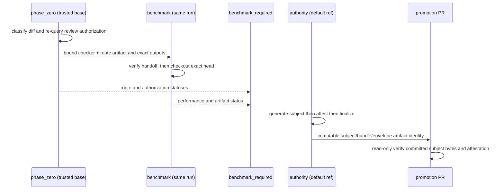

# Tech Spec：聊天布局 benchmark artifact、可信 baseline 与 promotion gate

## Linked Issue

GH-85: https://github.com/majiayu000/rnk/issues/85

## Product Spec

见 [`product.md`](product.md)。

GH-85 消费 GH-61 的 immutable snapshot producer、parity 与 per-frame deterministic work
counters，不改变其 layout/recovery 语义。#61 的实时label不是授权来源；GH-85 implementation
必须等 #61 实现合入后，在 exact merged SHA 上重新定位测量 seam。

## Codebase Context

以下锚点已在 `26499553b33a133071139d6baa6fce8b190ae0b3` 核实：

| Area | Files | Current behavior | Why relevant |
| --- | --- | --- | --- |
| Existing layout benches | `benches/layout.rs:71`, `benches/layout.rs:90`, `benches/layout.rs:137`, `benches/layout.rs:160` | Divan 只覆盖 engine creation、通用 full tree/grid/text/getters | 没有 chat mutation、strategy matrix、allocation/work artifact |
| Bench registration/deps | `Cargo.toml:76`, `Cargo.toml:83`, `Cargo.toml:85` | dev dependencies 已含 `serde_json`/`divan`，只注册现有四个 bench | 新 machine-readable bench 需要显式注册；依赖与 lockfile 必须同步 |
| Existing CI | `.github/workflows/ci.yml:50`, `.github/workflows/ci.yml:98`, `.github/workflows/ci.yml:225` | CI 编译 benches，并由 `ci-gate` 汇总八个既有 required jobs；没有base-owned benchmark trust root | 保持`ci.yml`与八job `ci-gate`不变；GH-85由独立base-owned workflow提供额外required check |
| CI concurrency | `.github/workflows/ci.yml:8` | 同一 ref 的旧 PR run 会被取消 | benchmark artifact 必须绑定当前 exact base/head，取消后的部分结果不可复用 |
| Coverage | `.github/workflows/ci.yml:183` | coverage 目前 `continue-on-error`，不负责 performance decision | benchmark gate 不得借 coverage 的 advisory 状态宣称 green |
| GH-61 measurement dependency | `specs/GH61/product.md:33`, `specs/GH61/tech.md:389`, `specs/GH61/tech.md:391`, `specs/GH61/tasks.md:54` | GH-61 规划 per-frame deterministic work counters，benchmark 已拆到 #85 | GH-85 只读消费 merged seam；不得先发明未合入 public API |
| Split provenance | `specs/GH61/product.md:46`, `specs/GH61/tasks.md:20` | 当前 packet 明确把 workload/baseline/promotion/regression gate 排除到 #85 | GH-85 范围对应拆分前 B-024 至 B-028 |

## 计划变更清单

```json
{
  "issue": 85,
  "complete": true,
  "paths": [
    ".github/benchmarks/gh61-baseline.json",
    ".github/scripts/check_gh61_benchmark.py",
    ".github/workflows/layout-benchmark-authority.yml",
    "Cargo.lock",
    "Cargo.toml",
    "benches/chat_layout.rs",
    "benches/support/chat_layout.rs",
    "specs/GH61/product.md",
    "specs/GH61/tasks.md",
    "specs/GH61/tech.md",
    "specs/GH85/product.md",
    "specs/GH85/tasks.md",
    "specs/GH85/tech.md",
    "tests/fixtures/gh61_benchmark_schema.json",
    "tests/fixtures/gh85_gh61_dependency.json",
    "tests/layout_snapshot_benchmark_contract.rs"
  ],
  "owners": {
    ".github/benchmarks/gh61-baseline.json": "SP85-T5B",
    ".github/scripts/check_gh61_benchmark.py": "SP85-T2A",
    ".github/workflows/layout-benchmark-authority.yml": "SP85-T2A",
    "Cargo.lock": "SP85-T2A",
    "Cargo.toml": "SP85-T2A",
    "benches/chat_layout.rs": "SP85-T2A->SP85-T2B",
    "benches/support/chat_layout.rs": "SP85-T2A",
    "specs/GH61/product.md": "current-spec-pr",
    "specs/GH61/tasks.md": "current-spec-pr",
    "specs/GH61/tech.md": "current-spec-pr",
    "specs/GH85/product.md": "current-spec-pr",
    "specs/GH85/tasks.md": "current-spec-pr",
    "specs/GH85/tech.md": "current-spec-pr",
    "tests/fixtures/gh61_benchmark_schema.json": "SP85-T2A",
    "tests/fixtures/gh85_gh61_dependency.json": "SP85-T7B",
    "tests/layout_snapshot_benchmark_contract.rs": "SP85-T1->SP85-T2A"
  },
  "spec_refs": [
    "specs/GH85/product.md#B-001",
    "specs/GH85/product.md#B-002",
    "specs/GH85/product.md#B-003",
    "specs/GH85/product.md#B-004",
    "specs/GH85/product.md#B-005",
    "specs/GH85/product.md#B-006",
    "specs/GH85/product.md#B-007",
    "specs/GH85/product.md#B-008",
    "specs/GH85/product.md#B-009"
  ]
}
```

`.github/benchmarks/gh61-baseline.json` 只属于 B-009 的后续独立 promotion PR；首次
implementation PR 的 diff/manifest 必须排除该路径。`target/gh61-baseline-candidate.json`
是 CI artifact，不入库，因此不在 planned repository paths 中。

## 设计方案

### 1. 依赖与 trusted phase-zero route classification

implementation 开始前必须同时满足：

- maintainer 对当前 exact packet/head 明确确认可以实施；readiness label 仅描述队列状态；
- #61 的 implementation 已合入，`GH61_MERGED_SHA` 已由 GitHub merged evidence 解析；
- duplicate search fresh通过，且maintainer明确授权两PR lifecycle中的implementation head；
  后续promotion head必须另行取得明确授权，前一PR授权不可复用。

GH-61 合入后先执行：

```sh
git merge-base --is-ancestor "$GH61_MERGED_SHA" HEAD
test "$(git show -s --format=%H "$GH61_MERGED_SHA")" = "$GH61_MERGED_SHA"
rg -n 'SnapshotBuildReport|SnapshotWorkCounters|visited_nodes|mutated_nodes|text_flow_recomputes|snapshot_nodes|rebuild_count' src tests
python3 -m json.tool tests/fixtures/gh85_gh61_dependency.json >/dev/null
cargo test --test layout_snapshot_benchmark_contract --locked \
  dependency_manifest_matches_merged_gh61_and_all_strategies -- --exact
```

`tests/fixtures/gh85_gh61_dependency.json` 是 closed dependency manifest，exact keys 为
`schema_version`、`issue`、`gh61_merged_sha`、`resolved_at_head`、`snapshot_report`、
`work_counter`、`strategy_entrypoints`、`counter_fields`、`prerequisite_commands`。两个
symbol object 只允许 `path`、`symbol`；三个 strategy entry 只允许 `strategy`、`path`、
`symbol`，且 strategy 集合严格等于 `{full, incremental, recovered}`；`counter_fields` 严格等于
`{visited_nodes, mutated_nodes, text_flow_recomputes, snapshot_nodes, rebuild_count}`。
`prerequisite_commands` 必须恰有三项；每项 exact keys 为 `id`、`category`、`spec_ref`、
`argv`、`working_directory`、`expected_exit_code`、`expected_matched`、`expected_passed`、
`expected_ignored`。`category` 是闭合 enum，必须按
`[parity, work_counter, allocation_correctness]` 顺序各出现一次；对应 `spec_ref` 必须严格为
`specs/GH61/product.md#B-012`、`specs/GH61/product.md#B-011`、
`specs/GH85/product.md#B-004`，不接受其他 category/ref pairing。`id` 与完整 `argv`
均唯一；`working_directory`必须是字面量`checkout_root`。`argv`必须匹配checker-owned闭合
allowlist：`["cargo","test",可选"--workspace",可选"--lib"或["--test",TEST_TARGET],
"--locked",EXACT_TEST,"--","--exact"]`；可选项顺序固定，`TEST_TARGET`/`EXACT_TEST`只能是
不含`/`、`\\`、`..`的单个UTF-8 token。其他Cargo子命令/flag、absolute path、manifest-path、
target-dir、shell token或环境赋值一律拒绝。parity 与
work-counter argv 必须由 GH-61 merged tree 中实际存在的 exact Rust tests 解析，不在本
spec 预写未来 GH-61 test 名。T7A只读search merged GH-61 tests/tasks verification：若其中
存在明确断言allocation counter归属、计数与reset语义的exact Rust test，discovery evidence
记录该真实argv；若不存在，只记录`missing(require GH85 fallback)`，不得提前写manifest。
T1随后创建并提交GH-85已规划
`tests/layout_snapshot_benchmark_contract.rs` 的 fallback，argv 严格等于
`["cargo","test","--test","layout_snapshot_benchmark_contract","--locked",
"allocation_counter_contract_is_correct_before_benchmark","--","--exact"]`，且
`working_directory="checkout_root"`。两条分支的 category/spec_ref 均保持
`allocation_correctness`/`specs/GH85/product.md#B-004`。expected 值固定为 exit 0、
matched 1、passed 1、ignored 0。
每个 path/symbol 必须在 `GH61_MERGED_SHA` tree 与 current HEAD 中唯一解析，merged SHA
必须是 HEAD 祖先。T7B只能在T1停止后定稿manifest：前两项取T7A real evidence，第三项取T7A
发现的real test或已经存在于T1 checkpoint的fallback；不存在的future test、placeholder或由
T2A稍后创建的路径都不得进入manifest。T2A只读消费final manifest并实现fallback behavior。
wiring test 必须实际调用三个 strategy 并读取所有
counters；缺字段、category 集不完整/重复/未知/错序、spec_ref 不匹配、
empty/missing/duplicate/unknown command、placeholder、absolute/traversal/symlink escape、
零匹配、多匹配、非祖先或任一
strategy 未接线都 blocked。

任何前置条件缺失均保持 blocked，不以本 spec 中的拟议类型或未来 GH-61 test 名替代真实
merged API。

### 2. Workload runner 与固定矩阵

`benches/support/chat_layout.rs` 构建确定 corpus/scenario，`benches/chat_layout.rs` 只负责
执行、分配采集与结构化输出。setup/tree construction 在计时区间外；每个 strategy 从等价
committed 起点运行同一 target。

| scenario | fixed input / minimum operations | required strategies |
| --- | --- | --- |
| `unchanged_frame` | 1000-message transcript；64 个相同 frame operations | full、incremental；recovered 禁止 |
| `streaming_delta` | 1000-message transcript；32 个 grapheme-safe ASCII/CJK/emoji/combining deltas | full、incremental、recovered |
| `append_message` | 1000-message committed 起点；64 次 single-message append | full、incremental、recovered |
| `middle_insert` | 1000-message committed 起点；32 次在 index 500 附近 insert | full、incremental、recovered |
| `variable_height_transcript` | 1000 messages；64 次 update 循环 1..12 logical rows，并含 CJK/emoji | full、incremental、recovered |
| `resize_invalidation` | 1000 messages；30 个完整 `120x40 -> 80x24 -> 120x40` cycles | full、incremental、recovered |

固定 benchmark 常量为：

```text
seed = 0x9e3779b97f4a7c15
default_target_size = 1000 messages
default_viewport_sequence = [(120, 40)]
resize_viewport_sequence = [(120, 40), (80, 24), (120, 40)]
message_corpus_revision = "gh85-chat-v1"
rust_toolchain = "1.88.0"
target = "x86_64-unknown-linux-gnu"
profile = { name="release", opt_level=3, lto="off", codegen_units=16,
            debug=0, debug_assertions=false, overflow_checks=false,
            panic="unwind", incremental=false, strip="none" }
runner_image = "ubuntu-24.04"
warmup_iterations = 3
leg_sample_count = 5
sample_count = 10 per scenario/strategy/batch row
batch_count = 3
paired_order = ABBA per batch
```

这些常量由support module唯一声明，schema fixture/checker/test引用同一合同，禁止维护第二份
名称或阈值表。workflow用exact `1.88.0` toolchain与`x86_64-unknown-linux-gnu` target构建，不能
解析`stable`、minimum range或runner当前预装版本。`ubuntu-24.04`是稳定compatibility label；
hosted image build/version只记diagnostic。toolchain/target/profile/runner-image合同变化必须走
`contract_update_bootstrap`，合入后重新authority measurement与promotion；不得在normal compare
自动接受。`sample_count < 10`、batch数不等于3或paired order不等于ABBA时artifact无效。

### 3. Closed artifact schemas 与 hash

candidate、canonical 与 current-run compare artifacts 共用一个 closed envelope。top-level
exact keys 为：

```text
schema_version, checker_revision, artifact_role, source_sha, refs,
content_sha256, config_sha256, cargo_lock_sha256,
message_corpus_revision, message_corpus_sha256, rustc, target, profile,
runner_compatibility, runner_observation, workload, build, prerequisite_results,
paired_order, comparison_id, execution_trace, rows
```

- `artifact_role` 闭集为 `candidate`、`canonical`、`compare_base_current_run`、
  `compare_head_current_run`。
- `refs`是按role区分的closed object。canonical exact keys为`historical_source_sha`、
  `authority_repository_id`、`authority_workflow_ref`、`authority_default_ref_sha`、
  `authority_run_id`；future compare用这些字段和canonical自身digest重新取得并验证
  platform attestation。其source只需在
  未来PR base ancestry中可验证，不等于当前invocation refs。candidate/current-run exact keys为
  `current_pr_base_oid`、`current_merge_base_sha`、`current_head_sha`、`current_run_id`，且
  `merge-base(base,head)==base`。两种refs shape不得混用。
- `runner_compatibility` exact keys为`os`、`arch`、`target`、`rustc`、`runner_image`，仅这些
  稳定字段参与canonical compatibility。`runner_observation` exact keys为`cpu_model`、
  `logical_cpu_count`、`kernel_release`、`hosted_image_build`；它只作诊断，不进入canonical staleness判断，但同一
  ABBA comparison的base/head observation必须逐字段相同。
- `workload` exact keys 为
  `seed`、`target_size`、`viewport_sequence`、`warmup_iterations`、`leg_sample_count`、
  `sample_count`、`batch_count`、`scenario_matrix`、`paired_order_contract`；后者固定为
  `{"bootstrap":"not_applicable","compare":"ABBA"}`。
- `build` exact keys 为 `source_sha`、`manifest_sha256`、`cargo_lock_sha256`、
  `executable_sha256`、`target`、`profile`。candidate/canonical build source 必须等于
  artifact `source_sha`；compare base/head build source 必须分别等于current refs的
  `current_pr_base_oid`/`current_head_sha`。即使 `execution_trace=[]`，candidate/canonical 也必须有 nonempty
  `executable_sha256`。build `cargo_lock_sha256`/`target`/`profile` 必须分别等于 top-level
  同名值。
- `prerequisite_results` 必须恰有三项，顺序/数量/id/category/spec_ref 必须与 dependency
  manifest commands 精确一致；entry exact keys 为 `id`、`category`、`spec_ref`、
  `argv_sha256`、`source_sha`、`exit_code`、`matched`、`passed`、`ignored`。category 闭集、
  顺序与 category/ref pairing 仍适用；每项必须 exit 0、matched 1、passed 1、ignored 0；
  candidate/current compare 的 result source 为current exact checkout，canonical 为历史
  authority source SHA。
- `paired_order` 只允许 `not_applicable` 或 `ABBA`；candidate/canonical 必须是
  `not_applicable`、`comparison_id=null`、`execution_trace=[]`，current-run compare 必须是
  `ABBA` 且具有同一 nonempty `comparison_id`。
- `execution_trace` entry exact keys 为 `pair_id`、`batch_index`、`sequence_index`、`role`、
  `source_sha`、`binary_sha256`；每个 pair 的 sequence 必须精确为
  `[(0,base),(1,head),(2,head),(3,base)]`，且每个 `binary_sha256` 必须等于对应 role
  artifact 的 `build.executable_sha256`。
- row exact keys 为 `scenario`、`strategy`、`operation_count`、`sample_count`、
  `batch_index`、`pair_id`、`median_ns`、`allocation_count`、`allocated_bytes`、
  `visited_nodes`、`mutated_nodes`、`text_flow_recomputes`、`snapshot_nodes`、
  `rebuild_count`、`sample_observations`。`sample_observations`必须恰有10项，entry exact keys为
  `leg_index`、`sequence_index`、`leg_sample_index`、`role`、`source_sha`、`binary_sha256`、
  `start_state_sha256`、`reset_sequence`、`timing_ns`、`allocation_count`、`allocated_bytes`、
  `visited_nodes`、`mutated_nodes`、`text_flow_recomputes`、`snapshot_nodes`、`rebuild_count`、
  `operation_counters`。`operation_counters`必须恰有`operation_count`项，entry exact keys为
  `operation_index`、`visited_nodes`、`mutated_nodes`、`text_flow_recomputes`、`snapshot_nodes`、
  `rebuild_count`；operation index严格为0..operation_count-1，每个counter nonnegative，
  `rebuild_count`只允许0/1。sample的五个work totals分别由对应per-operation字段以u128 checked
  sum后checked转回schema integer，任一overflow blocked。每个row由该数组直接聚合；current-run
  两个base legs或两个head legs各采5 samples，聚合后`sample_count=10`。每个same-role leg必须
  贡献其原始`leg_sample_index=0..4`各一次；leg/sequence/role/source/binary必须匹配ABBA trace，
  禁止跨leg reuse、drop、duplicate或renumber。start state hash全部相同；reset sequence在每个leg
  内严格0..4。

所有 object 层级都设置 `additionalProperties=false`；未知 key、duplicate JSON key、未知
enum、缺 required key、非法 null、负 counter 或越界 integer 一律 blocked。`median_ns`
必须大于0。10个timing值排序后，以0-based index 4和5的u64值转u128、checked相加并向下整除2；
溢出或输入数不等于10时blocked。每个sample在warmup后必须从同一serialized target state重建并
将allocation/work instrumentation归零，再执行exact operation_count；10个sample的allocation/
work字段必须逐字段相同，row直接记录该共同值，不求和或平均。GH-61 per-operation
`rebuild_count`只能为0/1；每个recovered sample的aggregate等于operation_count，其他strategy
为0。reset evidence缺失或deterministic字段不一致时blocked。

hash 统一使用 SHA-256 小写 hex：

- `message_corpus_sha256`：exact corpus UTF-8 bytes；
- `build.manifest_sha256`：build source worktree 的 exact `Cargo.toml` bytes；
- `build.cargo_lock_sha256` 与 top-level `cargo_lock_sha256`：build source worktree 的 exact
  `Cargo.lock` bytes；
- `config_sha256`：对仅含 `schema_version`、`checker_revision`、完整 `workload`、
  `runner_compatibility`、`message_corpus_revision`、`message_corpus_sha256` 的 RFC 8785
  canonical JSON bytes 求 hash；volatile runner observation明确排除；
- `content_sha256`：对完整 artifact 移除且只移除 top-level `content_sha256` 后的 RFC 8785
  canonical JSON bytes 求 hash；不得排除 `source_sha`、role、runner、trace 或 rows；
- `build.executable_sha256` 与 trace `binary_sha256`：checker 实际执行的 exact bench
  executable bytes；
- `prerequisite_results[].argv_sha256`：dependency manifest 对应 argv 的 length-prefixed
  UTF-8 string array bytes。

candidate 的 `source_sha`等于current refs的exact implementation head；canonical 的
`source_sha`等于authority历史exact merged implementation/contract-update source SHA；current-run base/head 的
`source_sha`分别等于current refs的base/head。candidate不能改role后成为canonical，
canonical 必须由独立 rerun 生成。bench-only allocation instrumentation 不进入 production
report，也不新增 public `Any`、arbitrary closure 或运行时 allocator replacement API。

role-specific refs采用上述两个互斥shape；canonical历史refs不与未来PR current refs比较
相等，只验证`historical_source_sha`是future base祖先且attestation绑定bytes/digest。candidate
与两类current-run artifact共享current exact refs。除candidate/canonical的
`comparison_id=null` 外不允许 null。candidate/canonical row 的 `pair_id` 是对
artifact role、source SHA、scenario、strategy、batch index 的 length-prefixed UTF-8
bytes 求 SHA-256；current-run row 使用 compare protocol 的 `pair_id`。

negative fixtures 至少包含：top-level/nested unknown key、duplicate JSON key、missing row
key、unknown role/order、role/source/build mismatch、missing/unknown build key、
content/config/corpus/binary hash mismatch、empty/missing/duplicate/unknown/failed
prerequisite command/result、prerequisite category missing/duplicate/unknown/wrong-order、
category/spec_ref mismatch、allocation fallback missing 或 benchmark-before-prerequisite、
zero timing、negative allocation、candidate-as-canonical、canonical-as-current-run、
missing/duplicate/cross-run/wrong-order pair、historical-source-not-ancestor、canonical/current
refs shape混用、base-not-ancestor、merge-base-mismatch、volatile-observation-pair-mismatch、
absolute/traversal/symlink-escape prerequisite、argv allowlist escape、caller-supplied baseline、
authority mismatch与incompatible stable class。每个 fixture 必须 schema-targeted，
不能用另一处更早的 parse failure 冒充目标 predicate 覆盖。

### 4. Checker CLI 与 deterministic pre-gates

`.github/scripts/check_gh61_benchmark.py` 使用参数数组调用外部命令，并提供闭合 CLI：

- `--list-scenarios`：输出 machine-readable exact scenario/strategy/minimum matrix；
- `--validate-dependency-manifest PATH --repo PATH --gh61-merged-sha SHA`：执行 dependency
  ancestry/anchor/strategy/counter fail-closed gate；
- `--validate-artifact PATH --expected-role ROLE`：验证 closed schema、unknown/duplicate keys、
  role、hash、historical/current refs、stable/volatile runner字段、paired order、nonzero
  operation/sample与所有counter；
- `--mode bootstrap --repo PATH --pr-base-oid SHA --head-sha SHA --run-id ID
  --target-root PATH --artifact-dir PATH --candidate-out PATH`：显式验证repo exact HEAD、base/head
  objects、base ancestry、exact merge-base、implementation diff与所有output containment后，只写
  non-authoritative candidate；不得从cwd、script path或环境隐式补任何参数；
- `--mode generate-authority-subject --repo PATH --repository-id ID --workflow-ref REF
  --default-ref-sha SHA --source-sha SHA --run-id ID --run-attempt N --target-root PATH
  --artifact-dir PATH --subject-out PATH --unsigned-metadata-out PATH`：仅default-ref-owned受信workflow
  可用，在repo外输出canonical subject与unsigned metadata；不得生成、伪造或内嵌attestation；
- `--mode finalize-authority --subject PATH --unsigned-metadata PATH --attestation-bundle PATH
  --attestation-id ID --repository-id ID --workflow-ref REF --default-ref-sha SHA --source-sha SHA
  --run-id ID --run-attempt N --authority-out PATH`：只能在`actions/attest@v4`成功后读取其exact
  `bundle-path`/`attestation-id` outputs，重验subject digest与workflow/run/source chain后输出final
  `authority.json`；missing/wrong output或bundle禁止finalize；
- `--mode validate-promotion --repo PATH --pr-base-oid SHA --head-sha SHA --run-id ID
  --run-attempt N --authority-envelope PATH --attestation-bundle PATH --authority-artifact-id ID
  --authority-artifact-digest DIGEST --authority-run-id ID --committed-canonical PATH`：read-only读取
  promotion head已提交blob与不可变authority handoff/GitHub artifact metadata，验证bytes/digest/
  attestation/diff；不得创建、修改或覆盖canonical path；
- `--mode compare --repo PATH --base-worktree PATH --pr-base-oid SHA --head-sha SHA
  --run-id ID --target-root PATH --artifact-dir PATH`：从 exact base tree 解析 canonical
  baseline，并在一个 checker process 内 build/run current base/head；不接受调用方任意
  `--base` artifact 或跨 run raw measurement。

#### 4.1 Base-owned phase zero

`.github/workflows/layout-benchmark-authority.yml`是唯一PR benchmark workflow。它必须先由独立
trust-root PR合入protected default ref，并由maintainer把exact check
`layout-benchmark-authority / benchmark_required`配置为branch-protection/ruleset required check；
完成前不得启动implementation measurement。`pull_request_target`只运行base-owned workflow；
`phase_zero`不得checkout/execute/import PR head文件。它从exact `PR_BASE_OID`（若该tree缺approved
checker则从exact protected default-ref SHA）用`git show`复制trusted checker到runner temp，记录
`trusted_policy_sha`与checker digest。两者都没有checker时blocked，PR-head checker不能自举。

phase zero在任何prerequisite/build/benchmark前验证base/head objects、base祖先关系与exact
merge-base，再以NUL分隔name/status/raw-mode读取raw diff、关闭rename自动接受并验证tree entry。
任一symlink(`120000`)、submodule(`160000`)、file type/mode change、rename/copy、case/path
normalization collision、unknown path class或空/ambiguous diff均blocked。closed safe path set精确为
regular files `README.md`、`CONTRIBUTING.md`、`CHANGELOG.md`、`LICENSE`及regular-file prefixes
`docs/`、`specs/`；classifier先剥离这些path。closed contract set精确为checker、authority workflow、
benchmark schema、dependency manifest、contract test、support config/corpus owner、`Cargo.toml`与
`Cargo.lock`；canonical单独分类。initial implementation path精确为`benches/chat_layout.rs`；
ordinary runtime set精确为regular Rust files under `src/`、`crates/rnk-style/src/`、
`crates/rnk-style-core/src/`、`crates/rnk-icons/src/`及`benches/chat_layout.rs`，其他path不得由宽泛
prefix自动接受。

剥离safe paths后的集合必须唯一命中：

| route | exact remaining-diff predicate | `route_status` |
| --- | --- | --- |
| `initial_implementation_bootstrap` | base无canonical；非空且只含approved initial implementation paths | `bootstrap_valid` |
| `contract_update_bootstrap` | base有canonical；非空且只含closed contract paths | `contract_update_valid` |
| `canonical_only_promotion` | base canonical缺失或不同；剩余集合精确为canonical path | `promotion_valid` |
| `normal_trusted_compare` | base有trusted canonical；非空且只含ordinary runtime paths | `comparison_valid` |
| `non_benchmark_change` | 剥离后为空且原diff非空 | `not_applicable_valid` |

ordinary source加safe paths仍是normal compare；initial/contract加safe paths仍走对应route；canonical
加safe paths仍只允许promotion validator验证canonical，任何canonical加unsafe path blocked。
contract+ordinary、initial+contract、unknown或多predicate命中均blocked。route classification本身不
读取review或给出performance结论。

initial/contract/promotion进入独立authorization phase。base-owned job以仅
`contents:read`/`pull-requests:read`的token每次调用GitHub REST，读取PR、reviews及reviewer
collaborator permission；caller-supplied review id/actor/permission均忽略。授权必须存在当前
non-dismissed `APPROVED` review，`commit_id==HEAD_SHA`，reviewer不等于PR author，body包含且只匹配
对应exact marker `[GH85 route: initial_implementation_bootstrap]`、
`[GH85 route: contract_update_bootstrap]`或`[GH85 route: canonical_only_promotion]`，且permission为
`maintain|admin`。对每个actor按GitHub API顺序只取latest decisive review；latest为
`CHANGES_REQUESTED`/`DISMISSED`或approval被dismiss时该actor失效。每次`synchronize`产生新head并
重新查询，旧head approval不可复用；approval submit/edit/dismiss后必须fresh re-run该PR的
`pull_request_target` check attempt，不能复用之前success。route artifact记录verified review id、actor、commit、marker、
permission与canonicalized API response SHA-256；普通compare/non-benchmark为
`authorization_status=not_required`。该route授权不替代最终human merge authorization。

三个status均为closed enum：`route_status`只允许`bootstrap_valid`、`contract_update_valid`、
`promotion_valid`、`comparison_valid`、`not_applicable_valid`、`blocked`；
`authorization_status`只允许`authorized`、`not_required`、`rejected`；`performance_status`只允许
`not_available`、`passed`、`regression`、`needs_rebaseline`、`blocked`。phase zero只产生route/auth，
不预写performance。benchmark完成normal compare后，只有`comparison_valid + not_required + passed`
映射为final `comparison_passed`；字段跨维度复用、unknown组合或缺字段均blocked。

`phase_zero`在同一run上传exactly one artifact，closed name为
`gh85-phase-zero-${run_id}-${run_attempt}-${pr_number}`，内容仅含trusted checker bytes与closed
route artifact；同时输出artifact id/digest/name及route/auth/base/head/raw-diff/trusted-policy字段。
route artifact绑定`run_id`、`run_attempt`、`pr_number`、base/head、merge-base、raw diff digest、
trusted policy/checker digest及上述authorization evidence。`benchmark`必须`needs: phase_zero`，
只在同一workflow/run以这些outputs下载唯一artifact，逐字段与download metadata/digest重验后才
checkout exact head；missing/duplicate/mismatch/cancel/replay/timeout均blocked。benchmark只执行
artifact中的trusted checker副本，并仅把head executable/measurement当untrusted bytes；不得导入
head checker/module/config。`benchmark_required`以`always()`汇总phase_zero与benchmark；只有route/
handoff/artifact validation均通过，且status tuple精确为
`(bootstrap_valid,authorized,not_available)`、
`(contract_update_valid,authorized,not_available)`、
`(promotion_valid,authorized,not_available)`、
`(not_applicable_valid,not_required,not_available)`或
`(comparison_valid,not_required,passed)`时check success。最后一项映射final
`comparison_passed`；其他tuple、regression、needs_rebaseline、blocked、cancelled或skipped均failure。

#### 4.2 Deterministic prerequisites

trusted checker 读取 dependency manifest 后严格按
`parity -> work_counter -> allocation_correctness` 顺序、以 `shell=false` 和声明的
`working_directory=checkout_root`执行三个prerequisite `argv`。checker先对checkout root取
realpath并验证其exact HEAD；解析所有manifest paths时拒绝absolute、`..`、NUL与symlink escape，
再把cwd固定为该root。argv必须匹配第1节closed Cargo exact-test allowlist；manifest不能指定
任意executor、cwd或environment。checker把每个 exact category/spec_ref/result
写入 `prerequisite_results`。command array 长度不为 3、category 缺失/重复/未知/错序、
spec_ref pairing 错误、id/argv duplicate、unknown key、test zero-match、failed/ignored 或
result 缺失/多出时，在 build/benchmark 前 blocked。allocation fallback 必须先由 GH-85
contract test 证明 allocation counter 对 operation 的归属、计数和 reset 语义，不能用一次
非零观察值替代 correctness。CI required job 先运行 dependency wiring 与全部 prerequisite
commands，再执行 artifact validation；任何前置失败都停止 performance decision，但上传
诊断 artifact，禁止捕获异常后返回 success。

### 5. Trusted baseline 与 compare

compare 通过 `git show <pr_base_oid>:.github/benchmarks/gh61-baseline.json` 读取 repo-owned
baseline，验证：

- `artifact_role=canonical`，历史`source_sha`与`refs.historical_source_sha`一致且是current
  PR base的祖先；它无需等于current base/head，且通常早于二者；
- closed schema、`content_sha256`、`config_sha256`、corpus/Cargo hashes 全部重算一致；
- authority attestation绑定canonical exact bytes/digest、historical source、default-ref SHA与
  immutable authority run；当前PR base/merge-base/head/run只从invocation参数验证，不写入或
  要求等于canonical历史refs。

trust/staleness predicate 是闭合的：

- baseline missing、不是从 exact base tree 读取、role 非 canonical、content hash/attestation
  无效、historical source不在current base ancestry或current invocation refs无效：
  `blocked`；
- baseline 自身按其 schema 有效且 ancestry 可信，但 schema/checker/config/corpus/Cargo/
  toolchain/runner stable compatibility class 与 current compare 不兼容：`needs_rebaseline`；
- 只有所有 predicate 通过才是 `trusted`。checker 输出第一个及完整 `rejection_items[]`，
  不把 stale/untrusted 转换为零值 row。

canonical baseline 只授权 workload/config/fingerprint 可比较性与历史 promotion 来源；实际
threshold denominator 必须来自本次 run 的 `compare_base_current_run`，不能直接用 canonical
row，也不能复用 candidate 或旧 CI 的 raw base artifact。

所有bootstrap/compare/promotion validation在执行前必须证明base/head objects存在、
`git merge-base --is-ancestor PR_BASE_OID HEAD_SHA`成功，且
`git merge-base PR_BASE_OID HEAD_SHA == PR_BASE_OID`。bootstrap/compare还必须验证repo HEAD等于
HEAD_SHA；promotion validation以`git show HEAD_SHA:.github/benchmarks/gh61-baseline.json`读取
committed blob并与worktree path bytes一致，随后保持repo clean。失败时不得运行route-specific
executor。

PR path的结构必须等价于：

```yaml
name: layout-benchmark-authority
on:
  pull_request_target:
    types: [opened, synchronize, reopened, ready_for_review]
permissions: {}
jobs:
  phase_zero:
    permissions:
      contents: read
      pull-requests: read
    outputs:
      artifact_name: ${{ steps.route.outputs.artifact_name }}
      artifact_id: ${{ steps.route_upload.outputs.artifact-id }}
      artifact_digest: ${{ steps.route_upload.outputs.artifact-digest }}
      route_status: ${{ steps.route.outputs.route_status }}
      authorization_status: ${{ steps.route.outputs.authorization_status }}
      binding_digest: ${{ steps.route.outputs.binding_digest }}
    steps:
      # Never checkout/execute head; copy exact base/default-ref checker to RUNNER_TEMP.
      - id: route
        run: trusted-checker phase-zero with exact event refs and REST review re-query
      - id: route_upload
        uses: actions/upload-artifact@v4
        with:
          name: ${{ steps.route.outputs.artifact_name }}
          path: ${{ runner.temp }}/gh85-phase-zero
          overwrite: false
  benchmark:
    needs: phase_zero
    permissions:
      contents: read
    steps:
      - uses: actions/download-artifact@v4
        with:
          name: ${{ needs.phase_zero.outputs.artifact_name }}
          run-id: ${{ github.run_id }}
      - name: Verify same-run handoff before checkout
        run: verify id/digest/name/binding/run_attempt/pr/base/head/raw_diff/policy exactly
      - uses: actions/checkout@v4
        with:
          ref: ${{ github.event.pull_request.head.sha }}
          fetch-depth: 0
      - name: Run trusted checker copy
        run: checker-from-downloaded-artifact with exact head as untrusted input
  benchmark_required:
    if: ${{ always() }}
    needs: [phase_zero, benchmark]
    permissions:
      contents: read
    steps:
      - run: reject unless closed route/auth/performance result matrix is satisfied
```

job不得从`GITHUB_SHA`、`github.sha`、synthetic merge ref或本地branch推导refs。PR jobs没有
secret/write/OIDC权限；benchmark checkout只能发生在same-run handoff验证之后。workflow/job name
构成exact protected check `layout-benchmark-authority / benchmark_required`，rename即配置变更并
blocked。现有`.github/workflows/ci.yml`及其八job `ci-gate`保持独立且不变，不消费跨workflow
artifact，也不直接控制trusted benchmark。两个required checks各自必须通过；不得把一方结果
映射为另一方success。

CI 在同一 runner 上执行以下协议：

```sh
test -n "$HEAD_SHA"
test -n "$PR_BASE_OID"
git cat-file -e "${HEAD_SHA}^{commit}"
git cat-file -e "${PR_BASE_OID}^{commit}"
test "$(git rev-parse HEAD)" = "$HEAD_SHA"
git merge-base --is-ancestor "$PR_BASE_OID" "$HEAD_SHA"
test "$(git merge-base "$PR_BASE_OID" "$HEAD_SHA")" = "$PR_BASE_OID"
git worktree add --detach "$RUNNER_TEMP/gh85-base" "$PR_BASE_OID"
test "$(git -C "$RUNNER_TEMP/gh85-base" rev-parse HEAD)" = "$PR_BASE_OID"
python3 .github/scripts/check_gh61_benchmark.py \
  --mode compare \
  --repo "$GITHUB_WORKSPACE" \
  --base-worktree "$RUNNER_TEMP/gh85-base" \
  --pr-base-oid "$PR_BASE_OID" \
  --head-sha "$HEAD_SHA" \
  --run-id "$GITHUB_RUN_ID-$GITHUB_RUN_ATTEMPT" \
  --target-root "$RUNNER_TEMP/gh85-targets" \
  --artifact-dir "$RUNNER_TEMP/gh85-artifacts"
```

checker 以参数数组分别执行
`["cargo","build","--manifest-path",CHECKOUT/Cargo.toml,"--bench","chat_layout",
"--locked","--release","--target-dir",TARGET_DIR,"--message-format=json"]`：base 的
`CHECKOUT/TARGET_DIR` 是 exact base worktree/`$RUNNER_TEMP/gh85-targets/base`，head 是
`$GITHUB_WORKSPACE`/`$RUNNER_TEMP/gh85-targets/head`。checker 从 Cargo JSON 解析
executable，验证其 checkout source SHA，记录 executable bytes 的 `binary_sha256`；
build/setup 不进入 timing。

每个 leg 用参数数组运行
`[EXECUTABLE,"--scenario",SCENARIO,"--strategy",STRATEGY,"--batch-index",N,
"--leg-index",L,"--seed","0x9e3779b97f4a7c15","--warmup-iterations","3",
"--sample-count","5","--artifact-out",LEG_PATH]`。checker 验证 leg artifact 后才写
`$RUNNER_TEMP/gh85-artifacts/base-current-run.json` 与
`head-current-run.json`；leg files 不是可复用 comparison input。

`comparison_id` 是对 `run-id`、current `pr_base_oid`、current `head_sha`、stable compatibility
class、volatile observation、
`config_sha256` 的 length-prefixed UTF-8 bytes 求 SHA-256；`pair_id` 是对
`comparison_id`、scenario、strategy、batch index 的同样编码求 SHA-256。每个
scenario/strategy/batch 依次运行 A(base)、B(head)、B(head)、A(base)，每 leg 5 samples；
两个 A legs 聚合为一个 base row，两个 B legs 聚合为一个 head row。两份 current-run
artifacts 必须有相同 comparison/trace、互补 role/source、相同 pair set，且每个 trace 精确
为 sequence 0..3 的 ABBA。缺 pair、重复 pair、跨 run ID、错序、binary/source mismatch、
stable compatibility/config不同或同一ABBA内base/head volatile observation不同均blocked；
volatile observation与历史canonical observation不同只进入诊断。

每个leg sample在warmup后先从同一serialized target state重建、重置allocation/work counters，
再执行exact operation_count；reset、operation与raw observations都写入leg诊断。每个聚合row必须
精确消费10个timing observations；排序后取第5/第6个值，以u128 checked sum向下整除2得到
`median_ns`。10个sample的allocation/work/rebuild aggregates必须逐字段相同，row取共同值；
任何不一致或recovered `rebuild_count != operation_count`均blocked。

每个 scenario/strategy 分别计算 3 个 paired batch：

- timing：`head/base > 1.20` 且 `head-base > 50_000ns`，3 batches 至少 2 个满足才失败；
- allocation count：任一batch相对增加 `> 10%` 且绝对增加 `> 8` 即失败；
- allocated bytes：任一batch相对增加 `> 10%` 且绝对增加 `> 4096` 即失败。

timing base/head `median_ns` 任一为 0 都是 invalid denominator，整个 comparison blocked。
allocation metric 的 base/head 都为 0 时该 metric 无回归；base 为 0、head 大于 0 时相对条件
视为满足，但仍只有 head 严格大于对应绝对 floor（8 或 4096）才失败。该规则逐 metric、
逐 batch 应用，allocation不使用2-of-3；禁止除零、NaN/Infinity或warning + fallback。

### 6. Bootstrap 与独立 promotion

首次implementation PR不存在trusted baseline，只允许`initial_implementation_bootstrap`：

```text
route_status=bootstrap_valid
authorization_status=authorized
performance_status=not_available
promotion_required=true
```

candidate 必须绑定 exact implementation head 并验证 B-001 至 B-003；implementation diff
不得包含 canonical baseline。job 被取消、失败或只产生部分 artifact 时，candidate 不得进入
promotion。candidate必须具有`artifact_role=candidate`、current refs、
`paired_order=not_applicable`、empty trace与有效hash；unknown key或role/hash/source不一致时
blocked。bootstrap CLI的repo/base/head/run/target/artifact/output参数全部required；output必须
位于显式artifact dir，realpath containment验证通过，且不得是repo canonical path。candidate
不进入authority generation输入，也不能被未来run复用。

同一planned `.github/workflows/layout-benchmark-authority.yml`也承载post-merge authority job，
但PR jobs与authority job按event/permissions隔离。workflow必须存在于protected default ref，
top-level permissions为空；authority job exact permissions为以下四项，所有未列权限为`none`：

```yaml
on:
  pull_request_target:
    types: [opened, synchronize, reopened, ready_for_review]
  workflow_dispatch:
    inputs:
      source_sha:
        required: true
        type: string
permissions: {}
jobs:
  authority:
    if: >-
      github.event_name == 'workflow_dispatch' &&
      github.ref == format('refs/heads/{0}', github.event.repository.default_branch)
    permissions:
      contents: read
      id-token: write
      attestations: write
      artifact-metadata: write
    steps:
      - name: Generate unsigned subject and metadata
        run: trusted-checker --mode generate-authority-subject with all exact inputs
      - name: Attest canonical subject
        id: attest
        uses: actions/attest@v4
        with:
          subject-path: ${{ runner.temp }}/gh85-authority/canonical.json
      - name: Finalize authority envelope after attestation
        run: >-
          trusted-checker --mode finalize-authority
          --attestation-bundle "${{ steps.attest.outputs.bundle-path }}"
          --attestation-id "${{ steps.attest.outputs.attestation-id }}" with all exact inputs
      - name: Upload immutable authority handoff
        id: authority_upload
        uses: actions/upload-artifact@v4
        with:
          name: gh85-authority-${{ github.run_id }}-${{ github.run_attempt }}-${{ inputs.source_sha }}
          path: |
            ${{ runner.temp }}/gh85-authority/canonical.json
            ${{ runner.temp }}/gh85-authority/unsigned-metadata.json
            ${{ steps.attest.outputs.bundle-path }}
            ${{ runner.temp }}/gh85-authority/authority.json
          overwrite: false
```

authority job只能在implementation或authorized contract update已合入、source SHA是exact default
ref祖先且对应merge authorization evidence存在时由maintainer触发。PR head workflow、artifact、
checker或token不得调用`workflow_dispatch`、影响authority inputs或取得attestation；phase-zero
artifact也不授予authority。authority job不checkout PR head，不运行PR artifact，只运行其自身
trusted default-ref checker。`generate-authority-subject`先fresh测量并只写canonical subject与unsigned
metadata；`actions/attest@v4` step id必须是`attest`；`finalize-authority`只能在该step成功后消费exact
`${{ steps.attest.outputs.bundle-path }}`与`${{ steps.attest.outputs.attestation-id }}`。不得声称finalize
发生在attest之前，也不得让generator构造bundle或final envelope。

implementation或authorized contract update合入后，default-ref-owned受信workflow运行
`generate-authority-subject`。workflow只接受repository default branch的exact SHA与已记录
`AUTHORITY_SOURCE_SHA`（即对应已合入implementation或contract-update exact source SHA），在repo外两个隔离
目录分别作为source/target；验证default-ref object、source object、
`source_sha`是`default_ref_sha`祖先、source checkout exact HEAD、dependency manifest、closed
prerequisites、build/config/corpus hashes后fresh测量。unsigned metadata只记录subject digest、
repository/workflow/default-ref/source/run/attempt与closed artifact name；final `authority.json`在
attest之后闭合为：

```text
canonical_subject_path
canonical_sha256
historical_source_sha
repository_id
authority_workflow_ref
authority_default_ref_sha
authority_run_id
authority_run_attempt
attestation_id
attestation_bundle_sha256
authority_artifact_name
```

finalizer重算subject/bundle digest并验证bundle subject、repository/workflow/run/source和action
attestation id；canonical bytes不嵌入bundle digest，避免自引用。upload step完成后，T5A从
`authority_upload.outputs.artifact-id`与`artifact-digest`记录实际artifact id/digest/run/attempt/name；
这些post-upload字段不反写已上传内容。closed name在run/attempt/source维度唯一，`overwrite=false`；
同名重复、missing action output、bundle path越界或final envelope早于attest均blocked。

promotion CI按exact repository id、artifact id、run id/attempt、name与artifact digest从GitHub API
查询并下载immutable artifact，要求非expired且恰有canonical subject、unsigned metadata、action
bundle、final envelope各一份；missing/expired/wrong run/id/digest/name/bundle均blocked。随后以平台
root验证签名、issuer、subject与workflow identity；仅重算JSON hash不算authentication。authority
workflow与checker都不得写任何checkout中的
`.github/benchmarks/gh61-baseline.json`。implementation candidate、promotion branch contents或
caller提供的canonical bytes都不能作为authority输入。

promotion与future compare必须先核对local canonical SHA-256等于expected subject digest，再执行：

```sh
gh attestation verify "$CANONICAL_FILE" \
  -R "$EXPECTED_REPOSITORY" \
  --signer-workflow "$EXPECTED_REPOSITORY/.github/workflows/layout-benchmark-authority.yml" \
  --signer-digest "$AUTHORITY_DEFAULT_REF_SHA" \
  --source-ref "refs/heads/$DEFAULT_BRANCH" \
  --source-digest "$AUTHORITY_DEFAULT_REF_SHA" \
  --deny-self-hosted-runners \
  --format json >"$RUNNER_TEMP/gh85-attestation-verification.json"
```

trusted checker随后只从verified result的certificate/subject读取不可伪造identity，要求subject
digest精确等于canonical SHA-256、repository与workflow path/ref精确匹配、source digest等于
authority default-ref SHA、source ref为protected default ref、certificate event为
`workflow_dispatch`；不能用可由workflow控制的predicate字段替代certificate约束。

baseline-promotion PR的runtime diff只允许`.github/benchmarks/gh61-baseline.json`，其bytes必须
来自上述immutable authority handoff；closed safe docs/spec paths可被classifier剥离但不参与
promotion evidence。base-owned required workflow选择`canonical_only_promotion`，从exact promotion head用
`git show HEAD_SHA:.github/benchmarks/gh61-baseline.json`读取committed blob，并用
`validate-promotion` read-only验证：

1. current base/head objects存在，base是head祖先且exact merge-base等于base；
2. 剥离closed safe docs/spec paths后的diff精确等于canonical path，base blob缺失或与head blob不同；
3. GitHub API artifact metadata证明id/digest/name/run/attempt完全匹配、未expired且四个handoff文件
   各恰一份；final envelope的repository/workflow/run/default-ref/source链闭合，action bundle平台
   attestation签名与subject digest验证通过，historical source是promotion base祖先；
4. committed blob bytes与`canonical_bytes`逐byte相同，SHA-256与`canonical_sha256`一致，closed
   schema/content/config/corpus/build hashes重新计算一致；
5. validation前后repo status与canonical inode/bytes/digest保持不变，checker没有write handle。

任一失败返回blocked；CI不得调用authority generator、不得把`canonical-out`指向repo、不得先
覆盖committed file再验证。成功decision只能是`promotion_valid`，它不表示性能无回归。
promotion仍需current exact-head CI、independent review、resolved review threads与maintainer
对同一head的单独merge authorization；只有合入future base tree后才能用于normal compare。

## Product-to-Test Mapping

| Behavior invariant | Implementation area | Verification |
| --- | --- | --- |
| B-001 | fixed workload matrix | `cargo test --test layout_snapshot_benchmark_contract --locked fixed_six_scenario_matrix_has_minimum_nonzero_operations -- --exact` |
| B-002 | artifact aggregation/closed schema | `cargo test --test layout_snapshot_benchmark_contract --locked ten_sample_even_median_and_deterministic_counters_are_exact -- --exact`; `cargo test --test layout_snapshot_benchmark_contract --locked per_operation_counters_sum_checked_and_abba_samples_keep_leg_identity -- --exact`; `cargo test --test layout_snapshot_benchmark_contract --locked recovered_rows_aggregate_one_rebuild_per_operation -- --exact`; `cargo test --test layout_snapshot_benchmark_contract --locked closed_schema_rejects_unknown_duplicate_and_partial_rows -- --exact` |
| B-003 | roles/source/build/runner/ref separation | `cargo test --test layout_snapshot_benchmark_contract --locked artifact_hashes_cover_roles_sources_config_corpus_trace_and_rows -- --exact`; `cargo test --test layout_snapshot_benchmark_contract --locked all_roles_require_closed_build_provenance -- --exact`; `cargo test --test layout_snapshot_benchmark_contract --locked candidate_canonical_and_current_run_roles_are_not_interchangeable -- --exact`; `cargo test --test layout_snapshot_benchmark_contract --locked canonical_refs_are_historical_and_current_refs_are_invocation_scoped -- --exact`; `cargo test --test layout_snapshot_benchmark_contract --locked runner_compatibility_excludes_volatile_cpu_identity -- --exact`; `cargo test --test layout_snapshot_benchmark_contract --locked abba_requires_identical_current_runner_observation -- --exact`; `cargo test --test layout_snapshot_benchmark_contract --locked pinned_toolchain_target_profile_and_runner_class_are_closed -- --exact` |
| B-004 | base-owned same-run phase-zero/dependency/prerequisite gates | `cargo test --test layout_snapshot_benchmark_contract --locked phase_zero_uses_base_owned_checker_and_rejects_untrusted_head_policy -- --exact`; `cargo test --test layout_snapshot_benchmark_contract --locked phase_zero_rejects_mixed_spec_symlink_mode_and_ambiguous_diffs -- --exact`; `cargo test --test layout_snapshot_benchmark_contract --locked phase_zero_same_run_handoff_is_exact_and_replay_safe -- --exact`; `cargo test --test layout_snapshot_benchmark_contract --locked benchmark_required_check_identity_and_outcomes_are_closed -- --exact`; `cargo test --test layout_snapshot_benchmark_contract --locked dependency_manifest_matches_merged_gh61_and_all_strategies -- --exact`; `cargo test --test layout_snapshot_benchmark_contract --locked prerequisite_paths_and_argv_are_contained -- --exact`; `cargo test --test layout_snapshot_benchmark_contract --locked prerequisite_commands_execute_and_record_before_benchmark -- --exact`; `cargo test --test layout_snapshot_benchmark_contract --locked failed_prerequisite_never_reports_performance_green -- --exact` |
| B-005 | exact ancestry/ABBA/timing | `cargo test --test layout_snapshot_benchmark_contract --locked workflow_binds_event_head_and_base_without_merge_ref -- --exact`; `cargo test --test layout_snapshot_benchmark_contract --locked bootstrap_and_compare_require_base_ancestor_and_exact_merge_base -- --exact`; `cargo test --test layout_snapshot_benchmark_contract --locked same_runner_abba_builds_exact_base_and_head_and_rejects_pair_mismatch -- --exact`; `cargo test --test layout_snapshot_benchmark_contract --locked timing_requires_two_of_three_paired_regressions -- --exact`; `cargo test --test layout_snapshot_benchmark_contract --locked zero_timing_denominator_is_blocked -- --exact` |
| B-006 | allocation comparator | `cargo test --test layout_snapshot_benchmark_contract --locked allocation_requires_relative_and_absolute_thresholds -- --exact`; `cargo test --test layout_snapshot_benchmark_contract --locked allocation_regression_fails_on_any_paired_batch -- --exact`; `cargo test --test layout_snapshot_benchmark_contract --locked zero_allocation_denominator_uses_absolute_floor -- --exact` |
| B-007 | base-tree trust/stable compatibility gate | `cargo test --test layout_snapshot_benchmark_contract --locked trusted_baseline_rejects_self_stale_and_untrusted_sources -- --exact`; `cargo test --test layout_snapshot_benchmark_contract --locked trust_predicates_distinguish_blocked_from_needs_rebaseline -- --exact`; `cargo test --test layout_snapshot_benchmark_contract --locked canonical_refs_are_historical_and_current_refs_are_invocation_scoped -- --exact`; `cargo test --test layout_snapshot_benchmark_contract --locked runner_compatibility_excludes_volatile_cpu_identity -- --exact` |
| B-008 | five routes/auth/performance separation | `cargo test --test layout_snapshot_benchmark_contract --locked route_selection_is_mutually_exclusive_and_only_comparison_passed_is_green -- --exact`; `cargo test --test layout_snapshot_benchmark_contract --locked safe_docs_route_is_not_applicable_and_mixed_runtime_routes_are_closed -- --exact`; `cargo test --test layout_snapshot_benchmark_contract --locked route_authorization_accepts_current_maintainer_approval -- --exact`; `cargo test --test layout_snapshot_benchmark_contract --locked route_authorization_rejects_revoked_wrong_head_and_wrong_role_reviews -- --exact`; `cargo test --test layout_snapshot_benchmark_contract --locked route_authorization_and_performance_status_are_independent -- --exact`; `cargo test --test layout_snapshot_benchmark_contract --locked authorized_contract_update_is_non_green_and_requires_rebaseline_promotion -- --exact`; `cargo test --test layout_snapshot_benchmark_contract --locked bootstrap_requires_explicit_repo_refs_and_exact_merge_base -- --exact`; `cargo test --test layout_snapshot_benchmark_contract --locked implementation_writes_candidate_but_never_canonical_baseline -- --exact` |
| B-009 | three-stage authority/immutable read-only promotion | `cargo test --test layout_snapshot_benchmark_contract --locked authority_workflow_permissions_and_attestation_identity_are_exact -- --exact`; `cargo test --test layout_snapshot_benchmark_contract --locked authority_pipeline_requires_action_bundle_outputs_and_finalizes_after_attest -- --exact`; `cargo test --test layout_snapshot_benchmark_contract --locked authority_artifact_handoff_rejects_missing_expired_wrong_run_id_digest_or_bundle -- --exact`; `cargo test --test layout_snapshot_benchmark_contract --locked promotion_validation_is_read_only_and_authority_bound -- --exact`; `cargo test --test layout_snapshot_benchmark_contract --locked promotion_rejects_committed_blob_not_matching_authority -- --exact`; `cargo test --test layout_snapshot_benchmark_contract --locked bootstrap_and_promotion_never_self_authorize -- --exact`; manual diff check: promotion PR canonical bytes match exact authority handoff and records current exact-head repository CI、independent review、resolved threads与maintainer merge authorization |

## 数据流

```text
base-owned pull_request_target run
  -> phase_zero: exact refs/diff -> five-route classification -> REST authorization
  -> same-run route/checker artifact + exact job outputs
  -> benchmark: verify handoff, then checkout exact head
  -> deterministic prerequisites -> build/benchmark/artifact validation
  -> route_status + authorization_status + performance_status
  -> benchmark_required exact protected check

post-implementation exact merged SHA
  -> generate-authority-subject (subject + unsigned metadata)
  -> actions/attest@v4
  -> finalize-authority (action bundle path/id required)
  -> upload-artifact immutable four-file handoff
  -> independent baseline-promotion PR commits exact subject bytes
  -> read-only promotion validation
  -> independent review + current exact-head repository CI + resolved threads + maintainer merge authorization
  -> canonical baseline in future PR base tree
```

artifact 不进入 runtime 持久化或 public API。candidate 只作为 current-run CI artifact；canonical
baseline 是唯一 checked-in performance evidence。



## 备选方案

- **复用 `benches/layout.rs` 的通用 microbenchmark**：拒绝；没有 chat mutation、producer
  strategy 与 versioned artifact。
- **解析 Divan pretty output**：拒绝；未版本化文本不是稳定 machine contract。
- **单次 wall-clock 超阈值即失败**：拒绝；hosted runner 噪声会制造不稳定门。
- **从 feature head 读取 baseline**：拒绝；允许当前改动自行降低标准。
- **bootstrap 直接写 canonical baseline**：拒绝；把测量者、writer 与授权者合为同一 PR。
- **phase zero与benchmark拆成两个workflow/run**：拒绝；跨run artifact/status transport会引入
  cancel、replay与required-check竞态，单一base-owned run可以闭合identity与ordering。

## 风险

- **Security**：corpus/诊断可能含 terminal controls；artifact 使用 JSON 结构化字段，不把
  payload 拼入 shell。所有外部命令使用参数数组，禁止 command injection。
- **Compatibility**：GH-61 尚未实现，真实 work-counter seam 可能改变；实现必须在 merged
  SHA 重新定位并更新 spec，禁止用 guessed adapter 静默兼容。
- **Performance/CI noise**：runner 调度、thermal、toolchain 漂移影响 timing；same-runner
  ABBA、3 batches与双阈值控制噪声。stable compatibility class决定跨run可比性；volatile CPU
  observation不强绑canonical，但本次base/head必须一致。
- **Evidence**：bootstrap 没有旧 scenario baseline；其状态必须与 performance green 分离。
- **Authorization**：review会被dismiss或head会synchronize；每run重查REST并只接受exact-head
  maintainer approval，route授权与最终merge authorization分离。
- **Maintenance**：schema/support/checker/test 若复制常量会漂移；固定矩阵由一个 source
  生成并以 closed negative fixtures 验证。

## 测试计划

- [ ] Dependency：merged GH-61 ancestry、closed anchor manifest、full/incremental/recovered
      wiring 与全部 counter fields。
- [ ] Contract：固定matrix、minimum operations、exact 10-sample reset/checked even median、
      deterministic allocation/work equality、closed/unknown-key policy、historical/current refs、
      stable/volatile runner fields、source/config/corpus/content/binary hashes与负例。
- [ ] Comparator：base ancestor/exact merge-base、isolated builds、same-runner ABBA trace/pair
      identity、timing 2-of-3、allocation any-batch双阈值、zero denominator、self/stale/untrusted/
      missing baseline与stable compatibility mismatch。
- [ ] Lifecycle：five mutually-exclusive routes、REST review authorization、route/auth/performance
      status separation、same-run handoff/required-check identity、explicit bootstrap inputs、candidate
      non-reuse、三阶段default-ref authority、immutable upload/download handoff与read-only promotion。
- [ ] Full gates：
      `cargo fmt --all -- --check`；
      `cargo check --workspace --all-targets --all-features --locked`；
      `cargo clippy --workspace --all-targets --all-features --locked -- -D warnings -A clippy::collapsible_if -A clippy::manual_is_multiple_of`；
      `cargo test --workspace --all-targets --all-features --locked`；
      `RUSTDOCFLAGS="-D warnings" cargo doc --workspace --all-features --no-deps --locked`。
- [ ] GitHub：current exact-head required repository CI、independent review、resolved review
      threads与maintainer对同一head的explicit merge authorization；labels仅描述状态。

## 回滚方案

若 checker、harness 或 CI integration 产生错误阻断，整体回滚 GH-85 implementation PR，
恢复原有 CI；不得保留一个把 invalid evidence 判 green 的宽松 fallback。candidate 为
untracked artifact，可直接丢弃。

若仅 timing 因 runner noise 不可比较，可把 timing decision 降为 `needs_rebaseline`，但保留
required parity/work/allocation/schema/exact-head gates；不得删除 artifact 字段或伪造 base。
若 canonical baseline 有误，通过新的独立 promotion PR 重新测量和替换，不直接编辑 SHA 或
在 feature PR 内放宽阈值。回滚后 #85 保持打开，保存 exact failed head/CI/artifact/review
证据；#61 与其他 layout correctness 合同不回滚。
